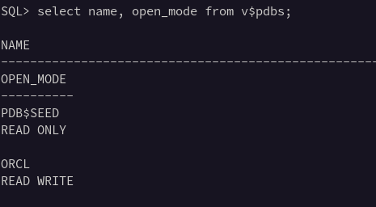

# Oracle-DataBase-19c-Installation-on-Docker

## Creating Docker Image

Here is the complete guide to installing Oracle database 19C in Docker.

1. Clone `https://github.com/oracle/docker-images`.
2. Download the Oracle Database 19c binary from [http://www.oracle.com/technetwork/database/enterprise-edition/downloads/index.html](http://www.oracle.com/technetwork/database/enterprise-edition/downloads/index.html)

- For X86, get `LINUX.X64_193000_db_home.zip`.
3. Run this in cd `OracleDatabase/SingleInstance/dockerfiles/`
4. Put the zip in the `OracleDatabase/SingleInstance/dockerfiles/19.3.0` directory. (Do not **UNZIP IT)**

```bash
./buildContainerImage.sh -v 19.3.0 -e
```

1. After that, enter the docker command to create a Database.

```bash
docker run \
--name oracle19c \
-p 1521:1521 \
-p 5500:5500 \
-e ORACLE_PDB=orcl \
-e ORACLE_PWD=orcldbpw \
-e INIT_SGA_SIZE=3000 \
-e INIT_PGA_SIZE=1000 \
-v /opt/oracle/oradata \
-d \
oracle/database:19.3.0-ee
```

1. Now check the list of running containers.

```bash
docker ps
```

1. Check Docker logs, to see the image creation percentage.

```bash
docker logs -f oracle19c
```

All done! 😊

To start and Stop the Docker container

```bash
$ docker container start oracle19c
$ docker container stop oracle19c

```

Start SQL terminal

```bash
docker exec -it oracle19c /bin/bash
```

```bash
sqlplus sys as sysdba
```

## Creating HR user

```bash
select name, open_mode from v$pdbs;
```



Make sure you are in the PDB model.

If in CDB model switch to the PDB model.

```bash
SHOW CON_NAME;
```

Switching between models

```bash
ALTER SESSION SET CONTAINER=ORCL;
```

Installing HR schema:

```bash
@?/demo/schema/human_resources/hr_main.sql;
```

Enter a secure password for `HR`

```bash
specify a password for HR as parameter 1:
Enter value for 1: **hr**
```

Enter an appropriate table space, for example, `users` as the default table space for `HR`

```basic
specify default tablespace for HR as parameter 2:
Enter value for 2: **users**
```

Enter `temp` as the temporary table space for `HR`

```bash
specify temporary tablespace for HR as parameter 3:
Enter value for 3: **temp**
```

Enter the directory path, for example, `*$ORACLE_HOME*/demo/schema/log/`, for your log directory

```bash
specify log path as parameter 4:
Enter value for 4: ***$ORACLE_HOME*/demo/schema/log/**
```


Unlock hr

```bash
ALTER USER HR ACCOUNT UNLOCK IDENTIFIED BY hr;
```

### SQL developer Connection

```bash
# sys user
Username: sys
Password: orcl

# hr user
Username: hr
Password: hr
Hostname: localhost
Port: 1521
Service name: ORCL
```

## Creating and altering user

### Creating table

```sql
select name, open_mode from v$pdbs;
--Alter session
ALTER SESSION SET CONTAINER=ORCL;
--create user
Grant dba to username identified by pass;
--example:
Grant dba to nyx identified by n;
```

